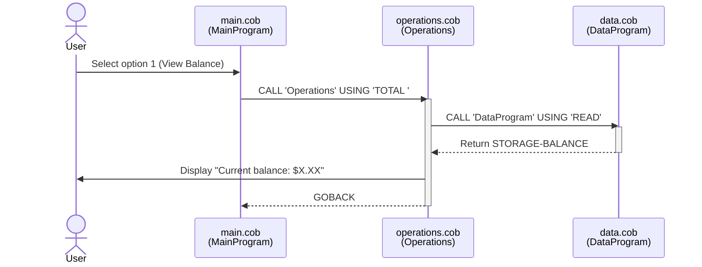
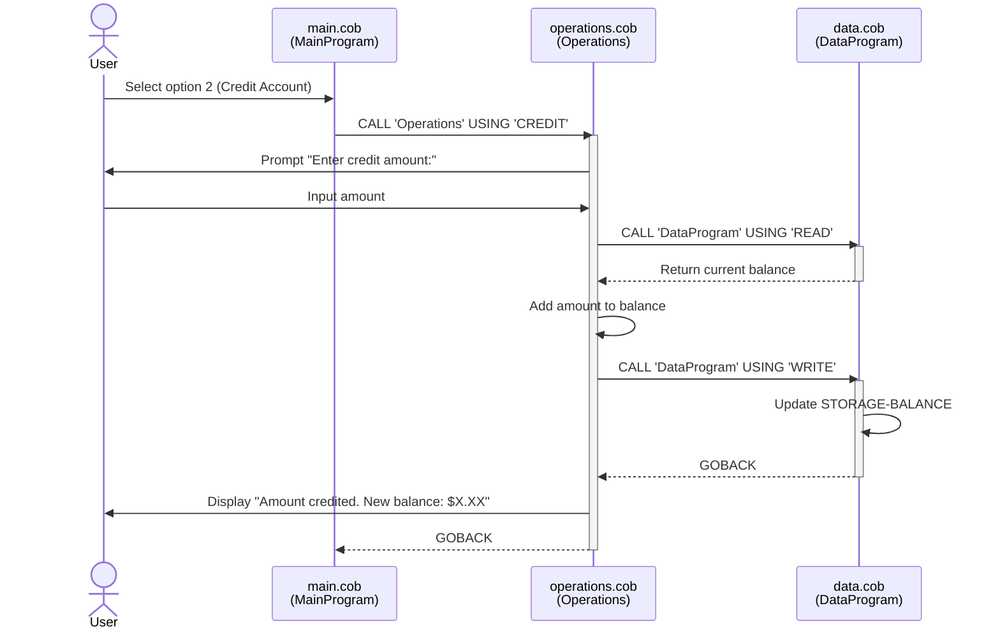
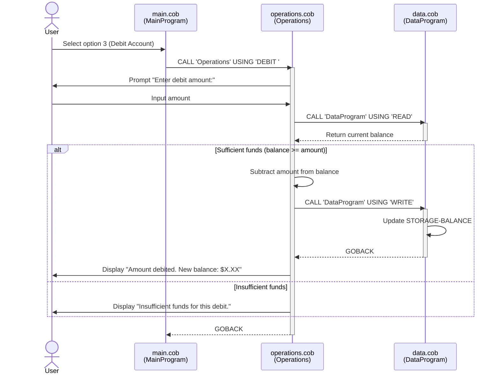
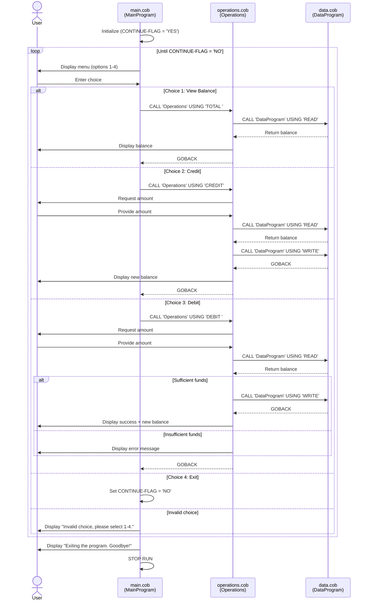

# School Accounting System - COBOL Documentation

## Overview

This is a legacy COBOL-based accounting system designed to manage school account transactions. The system follows a three-tier architecture pattern with separation of concerns between presentation, business logic, and data persistence.

## System Architecture

```
┌─────────────┐
│  main.cob   │  ← User Interface Layer
└──────┬──────┘
       │
       ▼
┌─────────────┐
│operations.cob│ ← Business Logic Layer
└──────┬──────┘
       │
       ▼
┌─────────────┐
│  data.cob   │  ← Data Persistence Layer
└─────────────┘
```

## File Descriptions

### main.cob - Main Program Controller
**Program ID:** `MainProgram`

**Purpose:** Entry point and user interface for the accounting system.

**Functionality:**
- Displays a menu-driven interface for account operations
- Handles user input and choice validation
- Routes operations to the business logic layer
- Manages program flow and exit conditions

**Menu Options:**
1. View Balance - Display current account balance
2. Credit Account - Add funds to the account
3. Debit Account - Withdraw funds from the account
4. Exit - Terminate the program

**Key Variables:**
- `USER-CHOICE` (PIC 9): Stores the user's menu selection (1-4)
- `CONTINUE-FLAG` (PIC X(3)): Controls program loop execution

### operations.cob - Business Logic Layer
**Program ID:** `Operations`

**Purpose:** Implements core accounting business logic and transaction processing.

**Key Functions:**

#### 1. View Balance (`TOTAL`)
- Retrieves current balance from data layer
- Displays balance to user
- Read-only operation

#### 2. Credit Account (`CREDIT`)
- Prompts user for credit amount
- Retrieves current balance
- Adds credit amount to balance
- Saves updated balance
- Displays new balance confirmation

#### 3. Debit Account (`DEBIT`)
- Prompts user for debit amount
- Retrieves current balance
- **Business Rule:** Validates sufficient funds before processing
- Subtracts debit amount if funds available
- Saves updated balance
- Displays appropriate message (success or insufficient funds)

**Key Variables:**
- `OPERATION-TYPE` (PIC X(6)): Type of operation to perform
- `AMOUNT` (PIC 9(6)V99): Transaction amount (up to $999,999.99)
- `FINAL-BALANCE` (PIC 9(6)V99): Working balance variable

**Business Rules Implemented:**
- Overdraft protection: Debits are rejected if they exceed available balance
- All monetary amounts support precision to 2 decimal places (cents)

### data.cob - Data Persistence Layer
**Program ID:** `DataProgram`

**Purpose:** Manages account balance storage with a simple read/write interface.

**Operations:**

#### READ Operation
- Returns the current stored balance to the caller
- Non-destructive query operation

#### WRITE Operation
- Updates the stored balance with a new value
- Persists balance changes

**Key Variables:**
- `STORAGE-BALANCE` (PIC 9(6)V99): Persistent balance storage (initialized to $1,000.00)
- `OPERATION-TYPE` (PIC X(6)): Requested operation ('READ' or 'WRITE')

**Initial State:**
- Default account balance: $1,000.00

## Business Requirements

### Account Management
- **Single Account System:** The system manages one account at a time
- **Initial Balance:** $1,000.00
- **Maximum Balance:** $999,999.99 (limited by PIC 9(6)V99 format)
- **Currency Precision:** Two decimal places for cents

### Transaction Rules

1. **Credit Transactions:**
   - No upper limit validation (constrained only by field size)
   - Immediately updates account balance
   - Provides confirmation with new balance

2. **Debit Transactions:**
   - Must not exceed current balance (overdraft protection)
   - Requires sufficient funds check before processing
   - Rejected transactions do not modify balance
   - Provides clear feedback on success or failure

3. **Balance Inquiry:**
   - Available at any time
   - Does not modify account state
   - Displays current balance

### Data Integrity
- Balance persists across operations within a session
- All balance updates are atomic (read-modify-write pattern)
- No negative balances allowed

## Technical Specifications

### Data Types
- **Balance Fields:** PIC 9(6)V99 (6 digits before decimal, 2 after)
  - Range: $0.00 to $999,999.99
- **Operation Codes:** PIC X(6) (6-character strings)
- **Menu Choices:** PIC 9 (single digit 1-4)

### Program Communication
- Uses COBOL `CALL` statements for inter-program communication
- Parameters passed via `USING` clause
- Subroutines return control with `GOBACK`

### Operation Codes
| Code | Purpose | Module |
|------|---------|--------|
| `TOTAL ` | View balance | operations.cob → data.cob |
| `CREDIT` | Add funds | operations.cob → data.cob |
| `DEBIT ` | Withdraw funds | operations.cob → data.cob |
| `READ` | Retrieve balance | data.cob internal |
| `WRITE` | Update balance | data.cob internal |

## Limitations and Considerations

1. **Single User:** No concurrent access controls
2. **In-Memory Persistence:** Balance is stored in program memory, not external storage
3. **No Transaction History:** No audit trail or transaction logging
4. **Limited Validation:** Minimal input validation on amounts
5. **Fixed Precision:** All amounts limited to 2 decimal places
6. **Session-Based:** Balance resets to $1,000.00 on program restart

## Potential Modernization Opportunities

- Database integration for persistent storage
- Multi-account support with account numbers
- Transaction history and audit logging
- Enhanced validation and error handling
- User authentication and authorization
- Reporting capabilities
- Web or mobile interface
- RESTful API implementation
- Automated testing framework

## System Sequence Diagrams

### View Balance Operation



### Credit Account Operation



### Debit Account Operation



### Complete Program Flow


